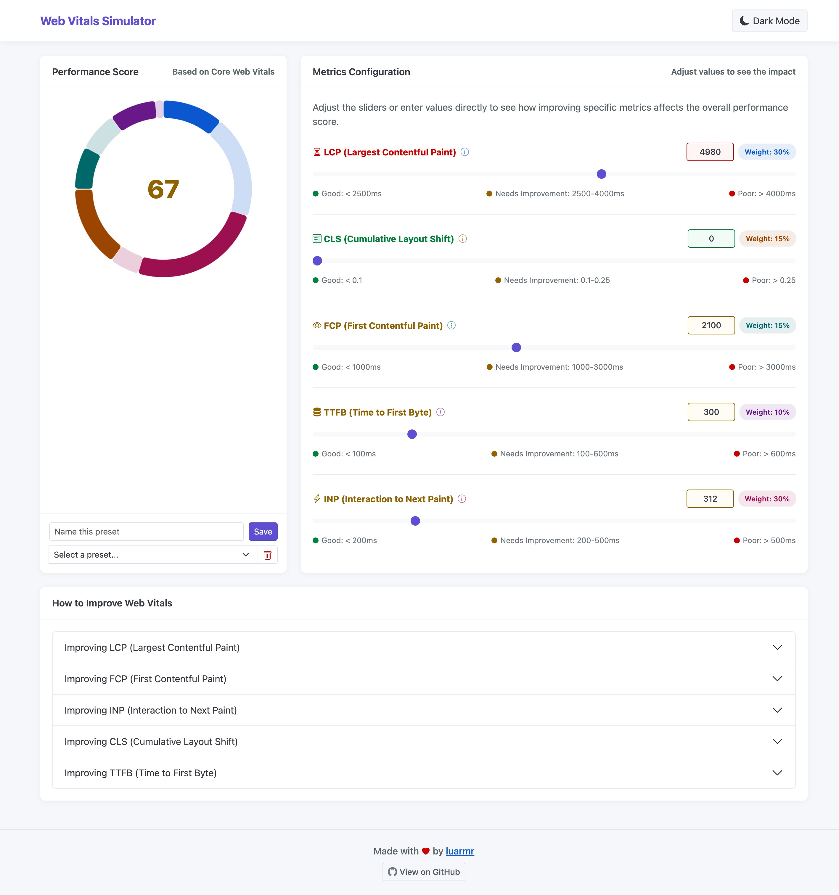

# Web Vitals Score Simulator

An interactive tool to visualize and understand how Core Web Vitals metrics affect your site's performance score.

## Purpose of this Tool

This simulator was created to help explain Web Vitals metrics in a visual, interactive way. It serves as:

- A communication tool for discussions with stakeholders and team members
- A visual guide to make abstract performance metrics more tangible
- A way to demonstrate the relative weight and impact of different metrics
- A bridge between technical performance data and practical business decisions

## Using the Simulator

1. Visit [the live demo](https://web-vitals-simulator.netlify.app/) or run locally
2. Adjust the sliders for each metric or enter values directly
3. Watch how the overall score changes in real-time
4. Explore the "How to Improve" sections for optimization tips
5. Save and compare different scenarios

## A Pragmatic Approach to Performance

This tool is meant to inform and educate—not to be taken as absolute truth:

- **Use as a guide, not gospel**: The simulator provides insights, not definitive answers
- **Balance priorities**: Performance is important but should be weighed against other needs
- **Focus on impact**: Address your worst-performing metrics first for the biggest gains
- **Context matters**: Different applications have different performance requirements

## Getting the Most from this Tool

- **Identify bottlenecks**: Quickly see which metrics are dragging down your score
- **Test scenarios**: Simulate potential improvements before committing development resources
- **Educate stakeholders**: Use the visual chart to explain technical concepts
- **Set practical goals**: Create achievable targets based on your specific situation and needs

## About the Accuracy

The simulator provides a simplified model of Web Vitals scoring:

- Actual field data varies based on devices, network conditions, and user interactions
- The weights and thresholds are based on common practices but aren't identical to any specific tool
- Web Vitals standards evolve over time (the simulator reflects 2023 standards)

Remember that this is primarily an educational tool, not a precise measurement system.

## Contributing

Contributions are welcome! Feel free to open issues or submit PRs to improve the simulator.

## License

MIT

## Credits

Made with ❤️ by [luarmr](https://github.com/luarmr)